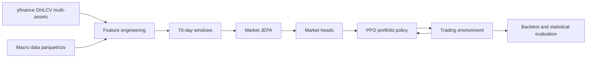
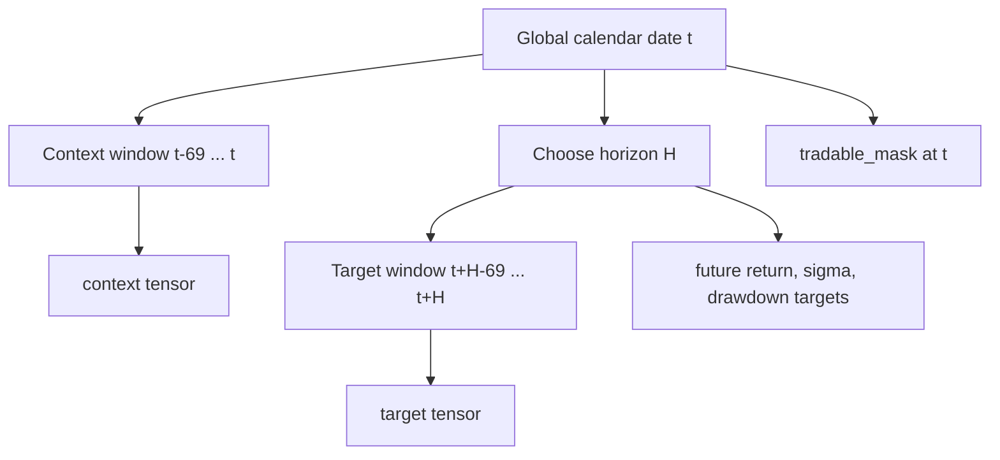
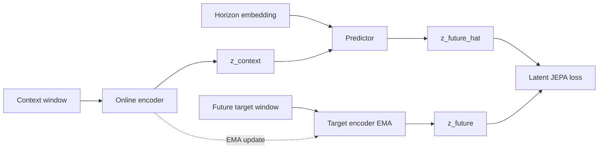
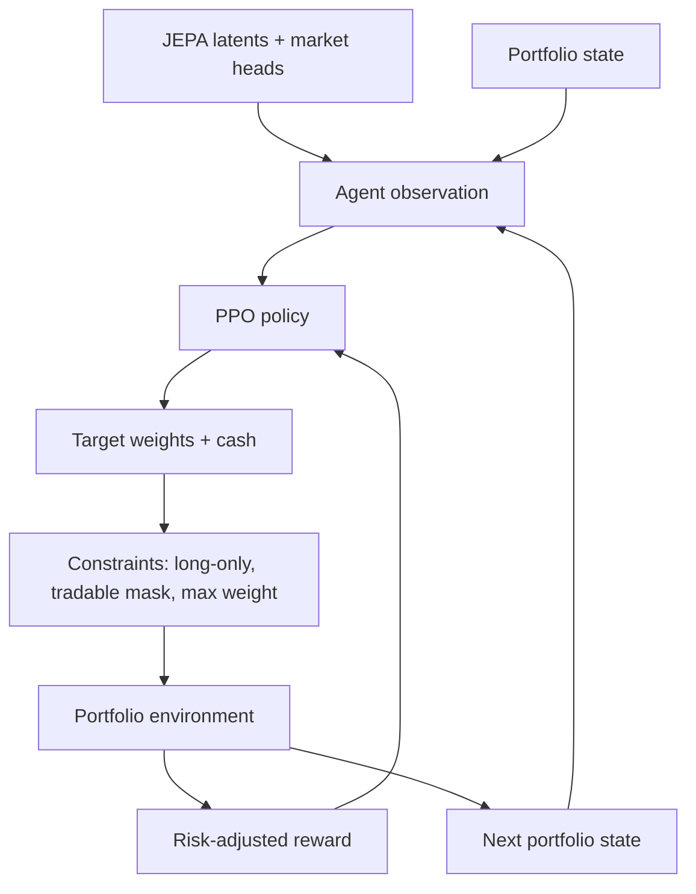
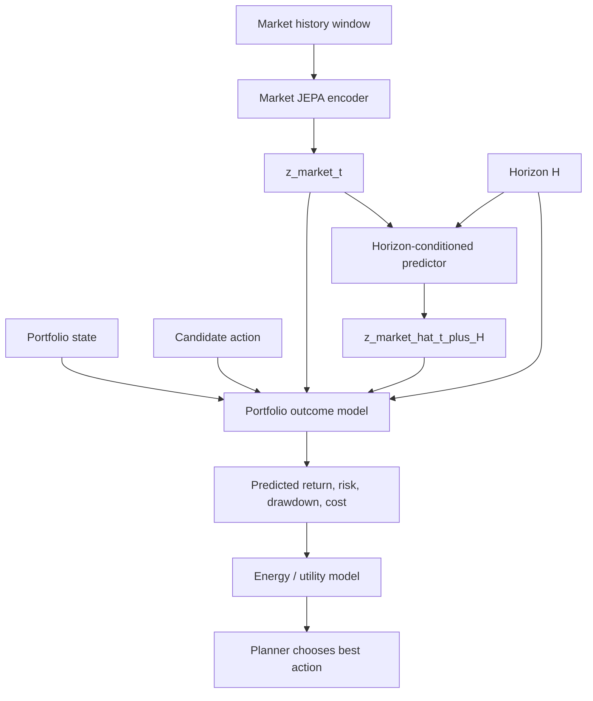
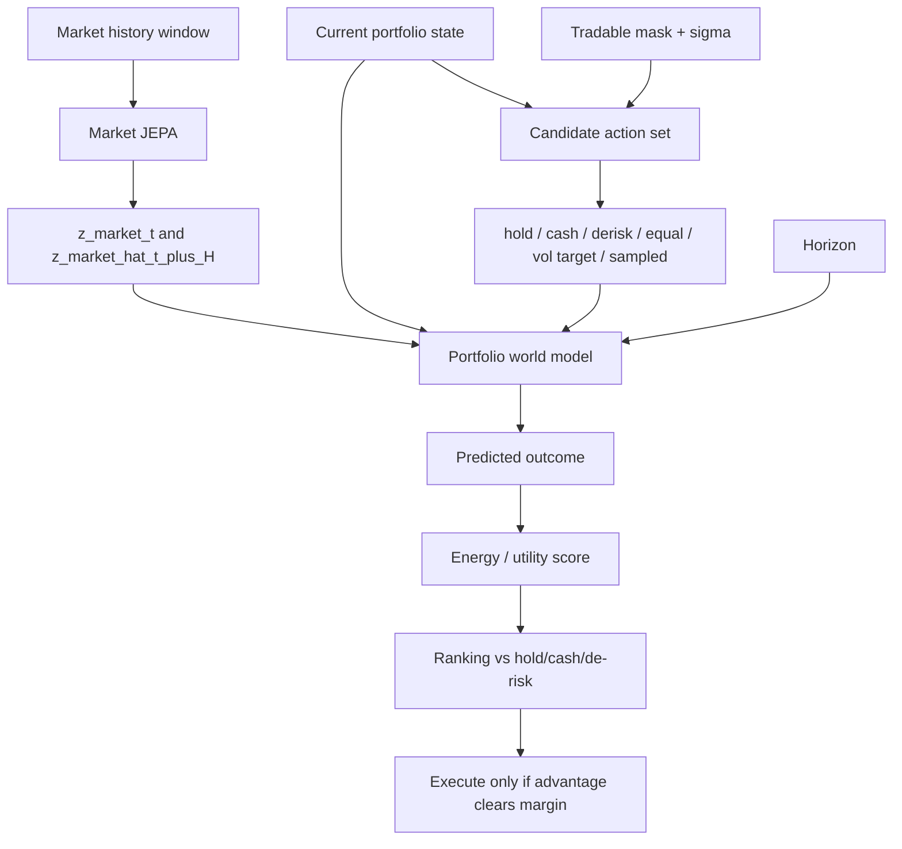

# Architecture du JEPA Trading Bot

Ce document explique l'architecture de `jepa-for-trading`, le rôle de chaque
bloc, et le processus complet depuis les données jusqu'au backtest final.

## 0. Vue rapide en schéma




## 1. Idée générale

Le projet construit un agent de trading multi-assets basé sur deux idées :

1. Apprendre une représentation latente du marché avec un modèle JEPA.
2. Utiliser cette représentation dans un agent RL direct qui gère un
   portefeuille réel avec cash, frais, poids, turnover et drawdown.

Le point important est que l'action de l'agent ne modifie pas le marché. Dans
ce cadre daily retail/research, l'agent n'a pas de market impact. Le modèle
prédit donc l'évolution latente du marché indépendamment de l'action, puis
l'action détermine uniquement l'exposition du portefeuille et donc le PnL,
les coûts, le risque et le drawdown.

## 2. Pipeline de données

Les prix viennent de `yfinance`. La macro vient de `macro_data.parquet` ou du
CSV `estimated_volatility_with_macro.csv` fourni sur Kaggle. Si le CSV est
utilisé, les colonnes `price` et `sigma` sont retirées du bloc macro, car la
volatilité doit être recalculée actif par actif.

Pour chaque actif, le pipeline construit :

- `log_return`;
- `overnight_gap`;
- `intraday_range`;
- features de volume;
- RSI normalisé;
- MACD;
- volatilité réalisée rolling;
- `sigma` par actif, calculée depuis son propre historique.

Les actifs peuvent commencer à des dates différentes. Le pipeline ne backfill
pas avant l'existence réelle d'un actif. Chaque date conserve un
`tradable_mask`, utilisé ensuite par le modèle et par l'agent pour empêcher
une allocation vers un actif non tradable.

Les splits sont temporels :

- train : apprentissage JEPA et heads;
- validation : checkpointing et early selection;
- test : backtest final jamais vu.

Les scalers sont fit uniquement sur train pour éviter le leakage.

```text
raw prices + macro
        |
        v
date/ticker panel
        |
        v
per-asset features:
    log_return, gaps, range, volume_z, RSI, MACD, realized vol, sigma
        |
        v
train-only scaling + chronological split
        |
        v
MarketArrays:
    dates x assets x features
    log_returns
    sigma
    close
    tradable_mask
```

## 3. Dataset multi-assets

Le dataset transforme le marché en fenêtres daily de 70 jours. Chaque sample
contient :

- `context` : fenêtre passée observée par l'encoder online;
- `target` : fenêtre future réelle observée par l'encoder EMA;
- `context_mask` et `target_mask` : disponibilité historique des actifs;
- `tradable_mask` : actifs réellement tradables à la date de décision;
- `horizon` : horizon de prédiction parmi `5, 15, 20, 45, 60`;
- targets auxiliaires : return futur, sigma future, drawdown futur.

La convention tensor principale est :

```text
batch x assets x time x features
```



## 4. Modèle JEPA de marché

Le JEPA est composé de trois blocs :


```text
online_encoder(context) -> z_context
predictor(z_context, horizon) -> z_future_hat
target_encoder_EMA(target) -> z_future
```

L'encoder online apprend normalement par gradient. L'encoder target est une
copie EMA de l'encoder online, mise à jour progressivement. Le predictor est
conditionné par l'horizon, ce qui permet au même modèle de prédire des
représentations futures à 5, 15, 20, 45 ou 60 jours.

La loss JEPA compare les latents normalisés :

```text
loss = distance(z_future_hat, stop_gradient(z_future))
```

Elle est masquée par `tradable_mask`, pour ne pas apprendre sur des actifs
non disponibles.

Le JEPA ne reconstruit pas les prix. Il apprend une représentation latente du
futur marché, plus proche de l'esprit I-JEPA/V-JEPA que d'un autoencoder
classique.



## 5. Market heads

Les heads transforment les latents JEPA en signaux financiers exploitables
par l'agent :

- quantiles de return : p10, p25, p50, p75, p90;
- sigma future par actif;
- drawdown futur;
- probabilité de return positif.

Ces heads ne remplacent pas le JEPA. Ils servent d'interface entre le monde
latent appris et la décision de portefeuille.

## 6. Environnement de trading

L'environnement simule une comptabilité de portefeuille daily :

- equity;
- cash;
- poids courants;
- turnover;
- coûts de transaction;
- drawdown courant;
- masque des actifs tradables.

A chaque step :

1. l'agent observe l'état de marché et son portefeuille;
2. il propose des poids cibles;
3. l'environnement applique les contraintes;
4. les frais sont retirés;
5. les returns du jour suivant modifient l'equity;
6. la reward est calculée.

Les contraintes V1 sont :

- long-only;
- cash autorisé;
- pas de leverage;
- poids maximum par actif;
- turnover maximum optionnel;
- impossible d'acheter un actif non tradable.

## 7. Agent PPO direct

L'agent est une policy PPO qui produit directement des target weights. Il ne
choisit pas un simple `buy/sell/hold` discret, car cela scale mal avec un
portefeuille de dizaines d'actifs.


Observation de l'agent :

- latents JEPA;
- outputs des market heads;
- validité des actifs;
- état du portefeuille : equity, cash, poids actuels, turnover, drawdown.

Action de l'agent :

```text
target_weights = [w_asset_1, ..., w_asset_n, w_cash]
```

La policy utilise une sortie softmax, puis l'environnement applique les
contraintes financières. La reward est risk-adjusted :

```text
reward =
    log_return_portfolio
    - transaction_costs
    - drawdown_penalty
    - turnover_penalty
    - concentration_penalty
```

Cette reward force l'agent à apprendre une gestion de portefeuille, pas
seulement une maximisation brute du PnL.



## 8. Evaluation

Le backtest final est lancé sur la période test uniquement. L'agent est
comparé à plusieurs baselines :

- Buy & Hold;
- equal weight;
- momentum simple;
- volatility targeting;
- 100 stratégies random long-only.

Les métriques calculées incluent :

- total return;
- CAGR;
- volatilité annualisée;
- Sharpe;
- Sortino;
- max drawdown;
- hit rate;
- turnover moyen;
- coûts totaux;
- poids cash moyen.

Les plots principaux sont :

- courbes d'equity;
- random strategies en gris;
- Buy & Hold en blanc;
- agent JEPA-PPO en vert fluo;
- drawdown;
- turnover.

Le test statistique principal est une p-value empirique :

```text
p_value = proportion des stratégies random qui battent l'agent
```

Une p-value faible indique que la performance de l'agent est difficile à
expliquer par un comportement random sous les mêmes contraintes.

```text
test period only
      |
      +--> JEPA-PPO agent equity
      +--> Buy & Hold equity
      +--> Equal Weight equity
      +--> Momentum equity
      +--> Vol Target equity
      +--> 100 random constrained strategies
              |
              v
metrics + p-value:
    P(random_total_return >= agent_total_return)
```

## 9. Workflow Kaggle

Le repo garde trois notebooks de cheminement :

```text
notebooks/01_v1_runned_jepa_ppo_failure_analysis.ipynb
notebooks/02_v2_world_model_planner.ipynb
notebooks/03_v3_world_model_abstention_planner.ipynb
notebooks/04_v4_risk_off_world_model_planner.ipynb
```

## V5. Action-Primitive World Model

La V5 corrige la derive des versions precedentes : le planner ne choisit plus
des strategies predefinies. Il optimise des primitives d'action, puis une
couche d'execution unique les transforme en poids de portefeuille executables.

```text
market history
   -> market JEPA encoder
   -> z_market_now
   -> market predictor by horizon
   -> z_market_future_hat

portfolio_state + primitive_action + executable_weights + z_market_now + z_market_future_hat
   -> portfolio world model
   -> future portfolio latent
   -> probabilistic outcomes

predicted outcomes + goal
   -> cost / energy model
   -> planner score
```

Le `goal` n'entre pas dans la dynamique du monde. Il sert seulement a evaluer
si les consequences predites d'une action sont desirables.

```text
PrimitiveAction:
    asset_scores[n_assets]
    gross_exposure_delta
    net_exposure_target
    cash_target_delta
    risk_budget
    rebalance_intensity
    horizon
    long_short_bias
```

Le planner V5 utilise un MPC/CEM :

```text
sample primitive actions
project through execution layer
predict probabilistic outcomes
score with cost model
keep elites
resample around elites
execute one action
replan tomorrow
```

Le notebook V1 documente le run exécuté et son échec. Le notebook V2 orchestre
le world model JEPA action-conditioned et le planner.

Le notebook V1 fait :

1. clone la branche `version1`;
2. installe le package avec le Python du kernel;
3. ajoute `src/` au `sys.path` pour éviter les problèmes Kaggle;
4. détecte le fichier macro dans `/kaggle/input`;
5. prépare les données multi-assets;
6. train le JEPA en `max_steps`;
7. train les market heads;
8. train PPO;
9. lance le backtest;
10. affiche métriques, plots et tests statistiques.

Le notebook contient aussi une cellule optionnelle pour pousser les artefacts
vers GitHub après entraînement. Elle utilise :

- `GITHUB_TOKEN` depuis Kaggle Secrets;
- `git lfs` si disponible;
- `git add .`;
- `git add -f` pour les dossiers d'artefacts ignorés par défaut;
- commit et push vers `version1`.

## 10. Résultat V1 runné

Le notebook exécuté `01_v1_runned_jepa_ppo_failure_analysis.ipynb` documente
un échec utile de la V1. La préparation des données fonctionne correctement :

```text
rows: 165325
assets: 31
features: 29
train samples: 18530
val samples: 3780
test samples: 4010
```

Le JEPA apprend un latent, mais généralise imparfaitement :

```text
final train_loss ~= 0.011
final val_loss   ~= 0.049
```

Les heads financiers échouent beaucoup plus clairement :

```text
final train loss ~= 7.13
final val loss   ~= 106.53
```

Le PPO diverge ensuite :

```text
rollout loss: NaN
rollout reward: NaN
equity: NaN
```

Les métriques de backtest contiennent des `NaN` et des `inf`, notamment sur
les returns, coûts et equity curves. Le test statistique imprimé dans le
notebook ne doit donc pas être interprété comme une réussite. Toute
interprétation positive est invalide dès qu'une métrique clé est non finie.

Conclusion : la V1 est une baseline d'échec/inconclusive. Elle justifie la V2,
où le modèle apprend en une boucle unifiée un world model JEPA régularisé par
VICReg, un portfolio outcome model action-conditioned et un planner.

## 11. Limites de la V1

Cette V1 est une architecture complète mais reste une base de recherche :

- les données `yfinance` ne sont pas survivorship-bias-free;
- les coûts sont simplifiés;
- il n'y a pas encore de borrow cost ni de short;
- pas de market impact;
- PPO peut surfit si la validation temporelle est faible;
- le nombre d'actifs et les hyperparamètres doivent être testés sérieusement.

La direction naturelle pour V2 est :

- univers plus large et plus propre;
- meilleure modélisation cross-assets;
- covariance/risk model explicite;
- walk-forward validation;
- policy distillation depuis un planner JEPA;
- contraintes de portefeuille plus institutionnelles.

## 12. V2 : world model JEPA action-conditioned

La V2 sépare explicitement deux niveaux :

```text
Market JEPA:
    market_history + horizon
        -> predicted future market latent

Portfolio World Model:
    market latent
    predicted future market latent
    current portfolio state
    candidate action
    horizon
        -> predicted portfolio outcome
```

Le portfolio n'entre pas dans le market JEPA, car ton portefeuille ne cause
pas le futur marché. En revanche, le portfolio entre dans le world model
d'action, car c'est lui qui détermine les conséquences d'une allocation.



La training loop V2 est unifiée. Un seul batch entraîne :

```text
L_total =
    L_JEPA
    + lambda_vicreg  * L_VICReg
    + lambda_outcome * L_portfolio_outcome
    + lambda_energy  * L_energy
    + lambda_policy  * L_policy_distillation
```

VICReg est ajouté pour éviter le collapse latent via variance et covariance
regularization, ce qui est particulièrement utile dans une architecture JEPA
avec EMA et actifs masqués.

Le planner V2 imagine plusieurs couples `(action, horizon)` :

```text
for action in candidate_actions:
    for H in horizons:
        predict portfolio outcome
        score with energy/utility

execute argmax(score)
```

Point numérique critique : les features du modèle peuvent être scalées, mais
les outcomes financiers et la simulation de portefeuille doivent utiliser les
rendements bruts. Utiliser un `log_return` robust-scalé dans `exp()` ou dans
une composition de portefeuille peut créer des overflows massifs. La V2 garde
donc :

```text
features model:
    log_return scaled, sigma_log scaled, macro scaled

portfolio outcomes:
    log_return_raw, sigma_raw, close_raw
```

Les outcomes V2 sont calculés en log-domain, puis bornés :

```text
portfolio_log_return: clipped
drawdown: [-1, 0]
volatility: [0, 5]
turnover: [0, 3]
cost: [0, 1]
utility: [-3, 3]
```

Point mémoire critique : les trainers en `max_steps` ne doivent pas utiliser
`itertools.cycle(train_loader)`. Cette fonction garde en mémoire tous les
batches déjà vus pour pouvoir les rejouer, ce qui peut remplir la RAM Kaggle
après plusieurs centaines ou milliers de steps. La V2 utilise donc un itérateur
DataLoader recréé manuellement à chaque fin d'epoch, sans cache.

Les modes portfolio sont configurables :

```yaml
portfolio:
  mode: long_only        # or long_short, market_neutral
  max_long_weight: 0.15
  max_short_weight: 0.05
  max_gross_exposure: 1.0
  max_net_exposure: 1.0
```

## 13. Résultat V2 runné

Le notebook exécuté `02_v2_world_model_planner.ipynb` montre que la V2 corrige
le problème principal de la V1 : le backtest est numériquement valide. Les
garde-fous indiquent :

```text
valid_backtest=True for:
    V2 JEPA Planner
    Buy & Hold
    Equal Weight
    Momentum
    Vol Target
```

Résultats test-period :

```text
Buy & Hold:
    total_return: 0.171
    CAGR: 0.047
    Sharpe: 1.832
    max_drawdown: -0.034
    total_cost: 0.20

Equal Weight:
    total_return: 1.144
    CAGR: 0.250
    Sharpe: 1.828
    max_drawdown: -0.161
    total_cost: 1.00

V2 JEPA Planner:
    total_return: 0.843
    CAGR: 0.196
    Sharpe: 1.520
    max_drawdown: -0.146
    avg_turnover: 0.400
    total_cost: 242.87
```

Tests statistiques :

```text
randomization test:
    p_value_random_beats_agent = 0.26

bootstrap vs Buy & Hold:
    mean_daily_excess_return = 0.0005566
    bootstrap_p_value_leq_zero = 0.003
```

Interprétation :

- La V2 est un run valide, contrairement à la V1.
- Le planner bat Buy & Hold en total return et en excess return bootstrap.
- La V2 ne bat pas Equal Weight, qui reste la meilleure baseline simple sur ce
  run.
- Le randomization test n'est pas suffisamment fort : 26% des stratégies
  random contraintes battent l'agent.
- Le planner sature le turnover max (`0.40`) presque tous les jours, ce qui
  crée des coûts très élevés.
- Les dernières décisions visibles utilisent l'horizon `5`, ce qui suggère un
  possible collapse vers le court terme.

Conclusion : la V2 réussit l'objectif architectural et numérique, mais pas
encore l'objectif trading. La prochaine étape doit viser :

```text
1. energy model plus sensible aux coûts et au turnover
2. pénalité d'action smoothing / changement de poids
3. diversification réelle des horizons
4. comparaison systématique contre Equal Weight et Vol Target
5. planner chunké et analyse des actions candidates
```

## 14. V3 : abstention, cash et risk-off planning

La V3 garde le principe central de la V2 : le market JEPA ne reçoit pas l'état
du portefeuille, car ton portefeuille ne modifie pas le futur marché. En
revanche, le portfolio world model reçoit bien l'état du portefeuille, l'action
candidate et l'horizon, car ce sont eux qui déterminent les conséquences
financières de l'action.

Le changement principal est que le planner ne compare plus uniquement des
actions random. A chaque décision, il voit toujours des actions défensives :

```text
candidate actions:
    hold current weights
    cash
    de-risk current weights
    equal weight
    volatility target
    sampled actions
```

La training loop V3 ajoute une loss de ranking :

```text
for each market window and horizon:
    evaluate candidate actions with realized future returns
    compute realized utility for each action
    label best action

model learns:
    JEPA future latent
    portfolio outcomes for all candidates
    energy / utility for all candidates
    policy distillation toward best action
    ranking margin: best candidate score > alternatives
```

Schéma V3 :



Au backtest, la règle d'exécution devient :

```text
best = argmax(score - turnover_penalty)

if best_score <= hold_score + no_trade_margin:
    execute hold
elif predicted_drawdown is too bad:
    execute cash or de-risk if comparable
else:
    execute best
```

L'objectif n'est pas de garantir une performance positive. L'objectif V3 est de
corriger un défaut précis de V2 : l'agent trade trop souvent, paie trop de
frais, et ne possède pas assez de mécanisme pour rester cash/risk-off quand le
marché devient défavorable.

## 15. V4 : risk-off explicite et diagnostics de portefeuille

Le run V3 a montré un comportement différent du problème V2. V3 ne trade plus
trop. Il trouve surtout une allocation initiale, puis conserve cette position
pendant presque tout le backtest. La performance peut être bonne, mais le
comportement ressemble davantage à :

```text
JEPA-selected portfolio + buy-and-hold
```

qu'à :

```text
adaptive world-model planner
```

La V4 corrige donc un autre défaut : le modèle doit apprendre explicitement
quand `cash` ou `derisk` doivent battre `hold`.

La utility d'entraînement V4 devient plus risk-aware :

```text
utility =
    return
    - alpha * abs(drawdown)
    - beta  * volatility
    - gamma * turnover
    - delta * costs
    - eta   * concentration
```

Si le futur réalisé de `hold` est mauvais :

```text
hold_drawdown <= seuil
or hold_return <= seuil
```

alors le dataset pénalise `hold` et booste `cash/derisk`. Le trainer ajoute
aussi une contrainte de ranking :

```text
risk-off sample:
    score(cash or derisk) > score(hold)
```

Le planner V4 ne choisit plus uniquement l'action avec l'energy apprise. Il
combine energy et outcomes prédits :

```text
planner_score =
    w_energy * energy
    + predicted_return
    - drawdown_penalty * abs(predicted_drawdown)
    - volatility_penalty * predicted_vol
    - turnover_penalty * turnover
```

Puis il applique une règle hard risk-off :

```text
if predicted_hold_drawdown <= threshold
or predicted_hold_return <= threshold:
    execute best(cash, derisk)
else:
    execute best action if advantage is sufficient
```

La V4 ajoute aussi des diagnostics obligatoires dans `outputs/v4_latest/` :

```text
agent_history.csv
planner_diagnostics.csv
portfolio_weights.csv
metrics.csv
random_summary.csv
equity_curves.png
drawdown.png
cash_weight.png
portfolio_weights.png
run_summary.json
```

Le fichier le plus important est `portfolio_weights.csv`, car il permet enfin
de voir ce que l'agent détient réellement actif par actif, et pas seulement
l'equity curve.

## 16. Audit V4 : diagnostic et changement de cap

Le run V4 doit etre considere comme invalide. Les artefacts montrent une
strategie degeneree :

```text
avg_cash_weight   = 1.0
avg_gross_exposure = 0.0
avg_turnover      = 0.0
final_equity      = 1000.0
actions           = cash / hold seulement
```

Ce n'est donc pas une strategie prudente qui a choisi d'attendre. C'est un
planner qui n'entre jamais vraiment en position.

### Lecture de la loss V4

Les checkpoints disponibles indiquent :

```text
v4_world_model.pt:
    step     = 400
    val_loss = 0.283

v4_world_model_run2.pt:
    step     = 600
    val_loss = 0.323
```

Le second run est donc pire que le premier. Continuer l'entrainement a degrade
la validation loss. La decomposition recalculee sur validation donne environ :

```text
V4 step 400:
    loss                 0.272
    jepa_loss            0.091
    vicreg_loss          1.801  -> contribution 0.090 avec poids 0.05
    outcome_loss         0.019
    energy_loss          0.082  -> contribution 0.041 avec poids 0.5
    rank_loss            0.042  -> contribution 0.030 avec poids 0.7
    risk_off_rank_loss   0.006
    risk_on_rank_loss    0.076

V4 step 600:
    loss                 0.315
    jepa_loss            0.130
    outcome_loss         0.018
    energy_loss          0.081
    rank_loss            0.052
```

La degradation vient surtout de `jepa_loss`, pas seulement du planner. La
similarite latente reste raisonnable, mais le gap train/validation montre une
generalisation temporelle faible. En plus, la loss totale est dominee par
`JEPA + VICReg`; elle ne mesure pas directement la qualite des decisions de
trading.

Interpretation :

```text
Le JEPA apprend une representation sur train,
mais la decision portfolio n'est pas alignee avec le backtest.
```

### Failles identifiees

1. Les outputs V4 precedents peuvent venir d'un code stale Kaggle : le planner
   a signale `hard_risk_off_defensive` alors que le portefeuille etait deja
   100% cash.

2. Il y a un mismatch train/backtest : le dataset calcule les outcomes sur les
   actions candidates, alors que l'environnement reel reprojette ces actions
   avec les contraintes de turnover, poids max et cash.

3. Les `portfolio_state` d'entrainement sont trop aleatoires et ne couvrent pas
   assez le cas critique `100% cash -> entrer en marche`.

4. La validation accepte une strategie 100% cash comme `valid_backtest=True`.
   Il manque des garde-fous de degenerescence : exposition moyenne, nombre de
   trades, diversite d'actions, concentration cash.

5. Le scoring final combine energy, return, drawdown, volatilite et turnover
   avec des poids manuels non calibres sur validation.

### Probleme conceptuel : pas encore un vrai world model action-conditioned

Les versions V1-V4 sont inspirees JEPA, mais elles ne sont pas encore un vrai
systeme de world model action-conditioned au sens fort. Le planner choisit
surtout le meilleur score local parmi des actions, mais le predictor latent ne
modele pas encore proprement les consequences de l'action sur l'etat du
portefeuille :

```text
market history
    -> latent JEPA
    -> outcome model
    -> score local / regle ad hoc
    -> action
```

Un vrai world model action-conditioned devrait plutot suivre :

```text
encoder_online(state_t) -> z_t
predictor(z_t, action_sequence, horizon) -> z_hat_t+H
encoder_EMA(real_future_state_t+H) -> z_target_t+H
loss = distance(z_hat_t+H, z_target_t+H)
```

Dans le trading, l'action ne doit pas pretendre modifier le futur marche. Elle
conditionne surtout les consequences portefeuille :

```text
portfolio_state
action / target weights
horizon
market latent
    -> future portfolio latent
    -> return, drawdown, volatility, cost, turnover
```

L'objectif de rendement-risque, par exemple `10% CAGR avec drawdown controle`,
n'est pas le conditionnement principal du JEPA. Il appartient au module de
cout/energie utilise par le planner pour evaluer les consequences predites des
actions.

La prochaine version ne doit donc pas ajouter une regle `risk-off` de plus.
Elle doit repartir d'un objectif plus propre :

```text
V5 = Action-Conditioned JEPA World Model Planner
```

### Recommandations finales

1. Ne pas interpreter V4 comme une strategie gagnante : le backtest est
   degenere.
2. Garder V3 comme meilleur artefact empirique actuel, mais le decrire comme
   `JEPA-selected portfolio + buy-and-hold`, pas comme un vrai planner adaptatif.
3. Pour V4, si on continue, utiliser plutot `v4_world_model.pt` que
   `v4_world_model_run2.pt`, car la validation loss est meilleure.
4. Pour la suite, retirer PPO et les regles ad hoc du coeur methodologique.
5. Construire V5 autour de `state + action -> imagined future -> cost/energy -> planning`.
6. Ajouter des validations bloquantes : strategie 100% cash, zero trade,
   exposition trop basse ou action diversity trop faible doivent rendre le
   backtest invalide.

## 17. V5 : action-conditioned JEPA world model

La V5 repart du principe suivant :

```text
Le marche evolue independamment de nos actions.
Le portefeuille, lui, evolue en fonction de nos actions.
```

Le JEPA de marche encode et predit le latent de marche :

```text
market_window_t -> encoder_online -> z_market_t
market_window_t+H -> encoder_EMA -> z_market_t+H
predictor_market(z_market_t, H) -> z_market_hat_t+H
```

Le world model action-conditioned predit ensuite l'etat futur du portefeuille :

```text
z_market_t
z_market_hat_t+H
portfolio_state_t
candidate_action
horizon
cost_context
    -> z_portfolio_hat_t+H
    -> predicted outcomes
    -> predicted goal/cost
```

Le target latent portefeuille est encode depuis l'etat futur realise du
portefeuille :

```text
future_portfolio_state_t+H -> target_portfolio_encoder_EMA -> z_portfolio_t+H
```

La loss V5 devient :

```text
L =
    market_jepa_loss
  + portfolio_action_jepa_loss
  + VICReg
  + outcome_prediction_loss
  + cost_prediction_loss
  + pairwise_action_ranking_loss
```

Le ranking compare les actions selon leur cout realise, pas selon une regle
cash/risk-off :

```text
if realized_cost(action_i) < realized_cost(action_j):
    predicted_cost(action_i) < predicted_cost(action_j)
```

La V5 corrige les derives V4 par construction :

```text
V4:
    cash devient une regle prioritaire
V5:
    cash est une action candidate comme les autres

V4:
    action entrainee != action executee
V5:
    projection d'action commune entre dataset, planner et environnement

V4:
    validation accepte 100% cash
V5:
    near-zero exposure ou zero trade invalide le backtest agent
```
