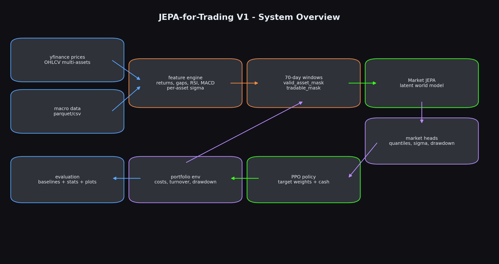
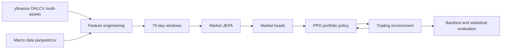
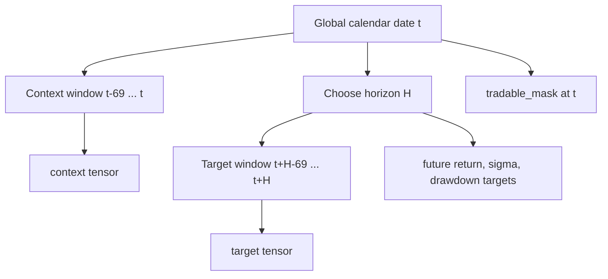
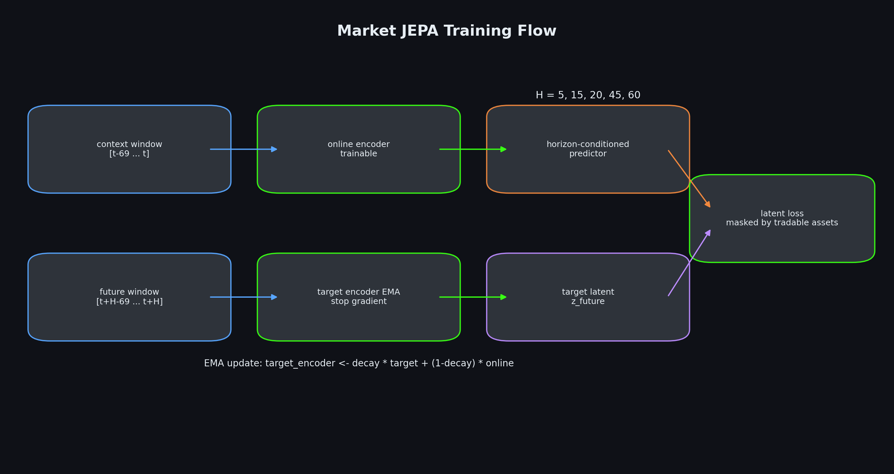
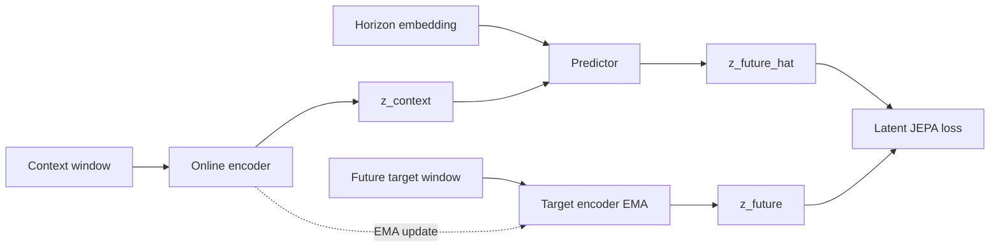
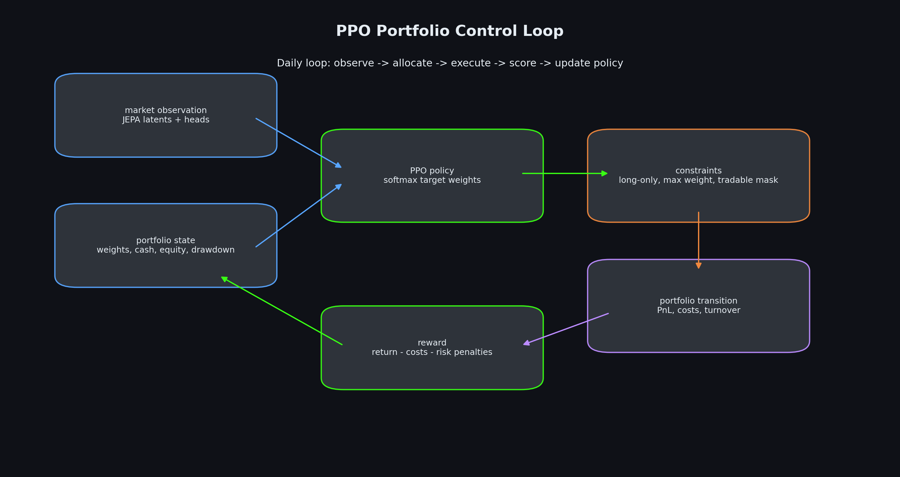
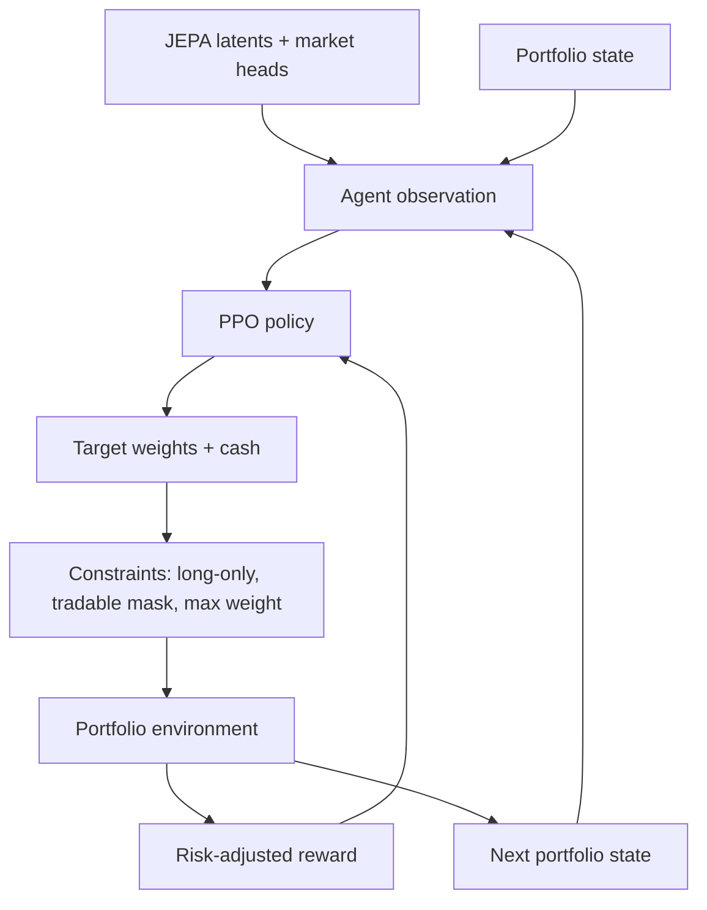
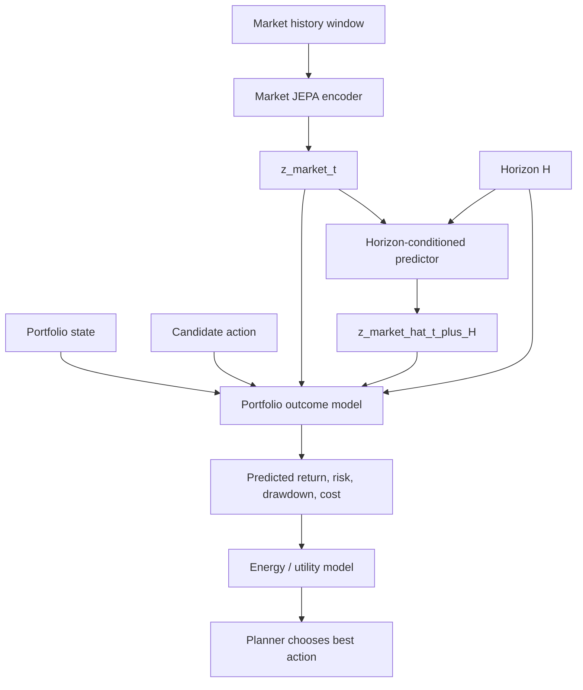

# Architecture du JEPA Trading Bot

Ce document explique l'architecture de `jepa-for-trading`, le rôle de chaque
bloc, et le processus complet depuis les données jusqu'au backtest final.

## 0. Vue rapide en schéma





## 1. Idée générale

Le projet construit un agent de trading multi-assets basé sur deux idées :

1. Apprendre une représentation latente du marché avec un modèle JEPA.
2. Utiliser cette représentation dans un agent RL direct qui gère un
   portefeuille réel avec cash, frais, poids, turnover et drawdown.

Le point important est que l'action de l'agent ne modifie pas le marché. Dans
ce cadre daily retail/research, l'agent n'a pas de market impact. Le modèle
prédit donc l'évolution latente du marché indépendamment de l'action, puis
l'action détermine uniquement l'exposition du portefeuille et donc le PnL,
les coûts, le risque et le drawdown.

## 2. Pipeline de données

Les prix viennent de `yfinance`. La macro vient de `macro_data.parquet` ou du
CSV `estimated_volatility_with_macro.csv` fourni sur Kaggle. Si le CSV est
utilisé, les colonnes `price` et `sigma` sont retirées du bloc macro, car la
volatilité doit être recalculée actif par actif.

Pour chaque actif, le pipeline construit :

- `log_return`;
- `overnight_gap`;
- `intraday_range`;
- features de volume;
- RSI normalisé;
- MACD;
- volatilité réalisée rolling;
- `sigma` par actif, calculée depuis son propre historique.

Les actifs peuvent commencer à des dates différentes. Le pipeline ne backfill
pas avant l'existence réelle d'un actif. Chaque date conserve un
`tradable_mask`, utilisé ensuite par le modèle et par l'agent pour empêcher
une allocation vers un actif non tradable.

Les splits sont temporels :

- train : apprentissage JEPA et heads;
- validation : checkpointing et early selection;
- test : backtest final jamais vu.

Les scalers sont fit uniquement sur train pour éviter le leakage.

```text
raw prices + macro
        |
        v
date/ticker panel
        |
        v
per-asset features:
    log_return, gaps, range, volume_z, RSI, MACD, realized vol, sigma
        |
        v
train-only scaling + chronological split
        |
        v
MarketArrays:
    dates x assets x features
    log_returns
    sigma
    close
    tradable_mask
```

## 3. Dataset multi-assets

Le dataset transforme le marché en fenêtres daily de 70 jours. Chaque sample
contient :

- `context` : fenêtre passée observée par l'encoder online;
- `target` : fenêtre future réelle observée par l'encoder EMA;
- `context_mask` et `target_mask` : disponibilité historique des actifs;
- `tradable_mask` : actifs réellement tradables à la date de décision;
- `horizon` : horizon de prédiction parmi `5, 15, 20, 45, 60`;
- targets auxiliaires : return futur, sigma future, drawdown futur.

La convention tensor principale est :

```text
batch x assets x time x features
```



## 4. Modèle JEPA de marché

Le JEPA est composé de trois blocs :



```text
online_encoder(context) -> z_context
predictor(z_context, horizon) -> z_future_hat
target_encoder_EMA(target) -> z_future
```

L'encoder online apprend normalement par gradient. L'encoder target est une
copie EMA de l'encoder online, mise à jour progressivement. Le predictor est
conditionné par l'horizon, ce qui permet au même modèle de prédire des
représentations futures à 5, 15, 20, 45 ou 60 jours.

La loss JEPA compare les latents normalisés :

```text
loss = distance(z_future_hat, stop_gradient(z_future))
```

Elle est masquée par `tradable_mask`, pour ne pas apprendre sur des actifs
non disponibles.

Le JEPA ne reconstruit pas les prix. Il apprend une représentation latente du
futur marché, plus proche de l'esprit I-JEPA/V-JEPA que d'un autoencoder
classique.



## 5. Market heads

Les heads transforment les latents JEPA en signaux financiers exploitables
par l'agent :

- quantiles de return : p10, p25, p50, p75, p90;
- sigma future par actif;
- drawdown futur;
- probabilité de return positif.

Ces heads ne remplacent pas le JEPA. Ils servent d'interface entre le monde
latent appris et la décision de portefeuille.

## 6. Environnement de trading

L'environnement simule une comptabilité de portefeuille daily :

- equity;
- cash;
- poids courants;
- turnover;
- coûts de transaction;
- drawdown courant;
- masque des actifs tradables.

A chaque step :

1. l'agent observe l'état de marché et son portefeuille;
2. il propose des poids cibles;
3. l'environnement applique les contraintes;
4. les frais sont retirés;
5. les returns du jour suivant modifient l'equity;
6. la reward est calculée.

Les contraintes V1 sont :

- long-only;
- cash autorisé;
- pas de leverage;
- poids maximum par actif;
- turnover maximum optionnel;
- impossible d'acheter un actif non tradable.

## 7. Agent PPO direct

L'agent est une policy PPO qui produit directement des target weights. Il ne
choisit pas un simple `buy/sell/hold` discret, car cela scale mal avec un
portefeuille de dizaines d'actifs.



Observation de l'agent :

- latents JEPA;
- outputs des market heads;
- validité des actifs;
- état du portefeuille : equity, cash, poids actuels, turnover, drawdown.

Action de l'agent :

```text
target_weights = [w_asset_1, ..., w_asset_n, w_cash]
```

La policy utilise une sortie softmax, puis l'environnement applique les
contraintes financières. La reward est risk-adjusted :

```text
reward =
    log_return_portfolio
    - transaction_costs
    - drawdown_penalty
    - turnover_penalty
    - concentration_penalty
```

Cette reward force l'agent à apprendre une gestion de portefeuille, pas
seulement une maximisation brute du PnL.



## 8. Evaluation

Le backtest final est lancé sur la période test uniquement. L'agent est
comparé à plusieurs baselines :

- Buy & Hold;
- equal weight;
- momentum simple;
- volatility targeting;
- 100 stratégies random long-only.

Les métriques calculées incluent :

- total return;
- CAGR;
- volatilité annualisée;
- Sharpe;
- Sortino;
- max drawdown;
- hit rate;
- turnover moyen;
- coûts totaux;
- poids cash moyen.

Les plots principaux sont :

- courbes d'equity;
- random strategies en gris;
- Buy & Hold en blanc;
- agent JEPA-PPO en vert fluo;
- drawdown;
- turnover.

Le test statistique principal est une p-value empirique :

```text
p_value = proportion des stratégies random qui battent l'agent
```

Une p-value faible indique que la performance de l'agent est difficile à
expliquer par un comportement random sous les mêmes contraintes.

```text
test period only
      |
      +--> JEPA-PPO agent equity
      +--> Buy & Hold equity
      +--> Equal Weight equity
      +--> Momentum equity
      +--> Vol Target equity
      +--> 100 random constrained strategies
              |
              v
metrics + p-value:
    P(random_total_return >= agent_total_return)
```

## 9. Workflow Kaggle

Le repo garde deux notebooks de cheminement :

```text
notebooks/01_v1_runned_jepa_ppo_failure_analysis.ipynb
notebooks/02_v2_world_model_planner.ipynb
```

Le notebook V1 documente le run exécuté et son échec. Le notebook V2 orchestre
le world model JEPA action-conditioned et le planner.

Le notebook V1 fait :

1. clone la branche `version1`;
2. installe le package avec le Python du kernel;
3. ajoute `src/` au `sys.path` pour éviter les problèmes Kaggle;
4. détecte le fichier macro dans `/kaggle/input`;
5. prépare les données multi-assets;
6. train le JEPA en `max_steps`;
7. train les market heads;
8. train PPO;
9. lance le backtest;
10. affiche métriques, plots et tests statistiques.

Le notebook contient aussi une cellule optionnelle pour pousser les artefacts
vers GitHub après entraînement. Elle utilise :

- `GITHUB_TOKEN` depuis Kaggle Secrets;
- `git lfs` si disponible;
- `git add .`;
- `git add -f` pour les dossiers d'artefacts ignorés par défaut;
- commit et push vers `version1`.

## 10. Résultat V1 runné

Le notebook exécuté `01_v1_runned_jepa_ppo_failure_analysis.ipynb` documente
un échec utile de la V1. La préparation des données fonctionne correctement :

```text
rows: 165325
assets: 31
features: 29
train samples: 18530
val samples: 3780
test samples: 4010
```

Le JEPA apprend un latent, mais généralise imparfaitement :

```text
final train_loss ~= 0.011
final val_loss   ~= 0.049
```

Les heads financiers échouent beaucoup plus clairement :

```text
final train loss ~= 7.13
final val loss   ~= 106.53
```

Le PPO diverge ensuite :

```text
rollout loss: NaN
rollout reward: NaN
equity: NaN
```

Les métriques de backtest contiennent des `NaN` et des `inf`, notamment sur
les returns, coûts et equity curves. Le test statistique imprimé dans le
notebook ne doit donc pas être interprété comme une réussite. Toute
interprétation positive est invalide dès qu'une métrique clé est non finie.

Conclusion : la V1 est une baseline d'échec/inconclusive. Elle justifie la V2,
où le modèle apprend en une boucle unifiée un world model JEPA régularisé par
VICReg, un portfolio outcome model action-conditioned et un planner.

## 11. Limites de la V1

Cette V1 est une architecture complète mais reste une base de recherche :

- les données `yfinance` ne sont pas survivorship-bias-free;
- les coûts sont simplifiés;
- il n'y a pas encore de borrow cost ni de short;
- pas de market impact;
- PPO peut surfit si la validation temporelle est faible;
- le nombre d'actifs et les hyperparamètres doivent être testés sérieusement.

La direction naturelle pour V2 est :

- univers plus large et plus propre;
- meilleure modélisation cross-assets;
- covariance/risk model explicite;
- walk-forward validation;
- policy distillation depuis un planner JEPA;
- contraintes de portefeuille plus institutionnelles.

## 12. V2 : world model JEPA action-conditioned

La V2 sépare explicitement deux niveaux :

```text
Market JEPA:
    market_history + horizon
        -> predicted future market latent

Portfolio World Model:
    market latent
    predicted future market latent
    current portfolio state
    candidate action
    horizon
        -> predicted portfolio outcome
```

Le portfolio n'entre pas dans le market JEPA, car ton portefeuille ne cause
pas le futur marché. En revanche, le portfolio entre dans le world model
d'action, car c'est lui qui détermine les conséquences d'une allocation.



La training loop V2 est unifiée. Un seul batch entraîne :

```text
L_total =
    L_JEPA
    + lambda_vicreg  * L_VICReg
    + lambda_outcome * L_portfolio_outcome
    + lambda_energy  * L_energy
    + lambda_policy  * L_policy_distillation
```

VICReg est ajouté pour éviter le collapse latent via variance et covariance
regularization, ce qui est particulièrement utile dans une architecture JEPA
avec EMA et actifs masqués.

Le planner V2 imagine plusieurs couples `(action, horizon)` :

```text
for action in candidate_actions:
    for H in horizons:
        predict portfolio outcome
        score with energy/utility

execute argmax(score)
```

Les modes portfolio sont configurables :

```yaml
portfolio:
  mode: long_only        # or long_short, market_neutral
  max_long_weight: 0.15
  max_short_weight: 0.05
  max_gross_exposure: 1.0
  max_net_exposure: 1.0
```
